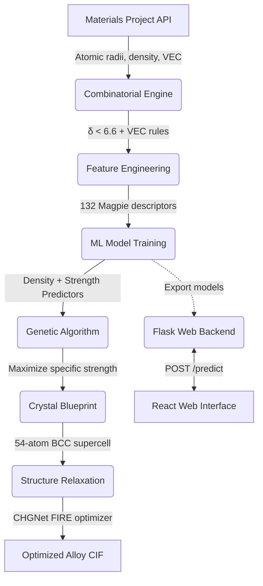

<div align="center">

# MetaForge
**ML-Powered High Entropy Alloy Discovery**

[](https://www.python.org/)
[](https://flask.palletsprojects.com/)
[](https://reactjs.org/)
[](https://materialsproject.org/)
[](https://github.com/CederGroupHub/chgnet)
[](https://opensource.org/licenses/MIT)

An end-to-end computational materials science pipeline for discovering optimal High Entropy Alloys (HEAs) for diverse applications including aerospace, corrosion resistance, refractory, and lightweight structural purposes. Combines data harvesting from the Materials Project, physics-informed machine learning, genetic algorithm-driven inverse design and ML interatomic potential relaxation.

</div>

---

## Core Features

> **Combinatorial Engine**<br>
> Generates thousands of theoretical alloy compositions and filters them using physics-based stability rules (lattice strain δ, VEC thresholds).

> **ML Property Prediction**<br>
> Trains RandomForest models on 132 Matminer Magpie descriptors to predict density and shear strength from composition.

> **Genetic Algorithm Inverse Design**<br>
> Evolves alloy compositions over 20 generations to maximize specific strength (strength-to-weight ratio).

> **CHGNet Structure Relaxation**<br>
> Relaxes 54-atom supercell blueprints using a graph neural network interatomic potential.

> **Real-Time Web Interface**<br>
> Flask app with interactive composition sliders, live ML predictions, and a composition donut chart.

---

## Architecture & Data Flow



---

## Tech Stack

**Core Engineering**<br>


**Machine Learning**<br>


**Web Application**<br>


---

## Quickstart

<details open>
<summary><b>1. Environment Setup</b></summary>

```bash
# Clone repository
git clone https://github.com/YOUR_USERNAME/MetaForge.git
cd MetaForge

# Create and activate virtual environment (Windows PowerShell)
python -m venv ----
.\----\Scripts\Activate.ps1

# Install core dependencies
pip install pymatgen mp-api python-dotenv numpy pandas scikit-learn matplotlib matminer chgnet flask flask-cors joblib
```
</details>

<details>
<summary><b>2. Configure API Keys</b></summary>

Create a `.env` file in the root directory and add your Materials Project API key:

```bash
# .env
MY_API_KEY=your_materials_project_api_key_here
```
*(Only required for data harvesting in Jupyter notebooks)*
</details>

<details>
<summary><b>3. Launch Web Application</b></summary>

Navigate to the web directory and start the Flask server using the virtual environment:

```bash
cd MetaForge-Web
..\----\Scripts\python.exe app.py
```
</details>

---

## Physics & Stability Filters

| HEA Family | Crystal Structure | Lattice Strain (δ) | VEC Range |
|------------|-------------------|---------------------|-----------|
| **Refractory** | BCC | δ < 6.6% | 5.0 ≤ VEC ≤ 6.8 |
| **Corrosion-Resistant** | FCC | δ < 6.6% | VEC ≥ 8.0 |
| **Lightweight** | Mixed/HCP | δ < 6.6% | — |

---

## License & Attribution

This project is open-source under the MIT License.

Special thanks to the foundational work by:
- **Materials Project**, Jain et al., APL Materials, 2013
- **Matminer**, Ward et al., Comput. Mater. Sci., 2018
- **CHGNet**, Deng et al., Nature Machine Intelligence, 2023
- **Pymatgen**, Ong et al., Comput. Mater. Sci., 2013
