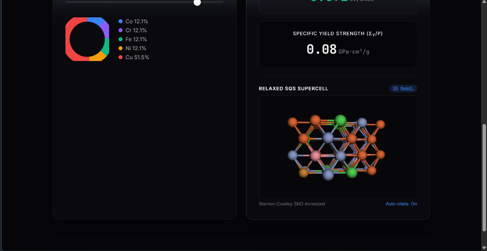
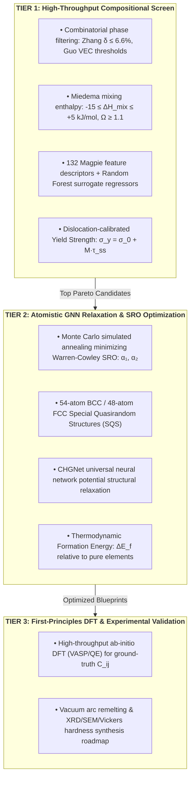

# MetaForge: Machine Learning-Accelerated High Entropy Alloy Discovery

[](https://opensource.org/licenses/MIT)
[](https://www.python.org/downloads/)

## Overview

**MetaForge** is a computational materials science pipeline designed to discover optimal High Entropy Alloys (HEAs) for aerospace, corrosion-resistance, lightweight structural, and high-temperature applications. It combines physics-informed machine learning with genetic algorithms for inverse design and graph neural network structural relaxation via CHGNet.



---

## Core Features

- **Combinatorial Engine:** Generates candidate alloy compositions and filters them using established physical metallurgy rules (e.g., lattice strain limits δ < 6.6% and specific VEC phase thresholds).
- **Property Prediction:** Utilizes Random Forest regression models trained on 132 Matminer Magpie descriptors to predict continuum density and dislocation-calibrated yield strength ($\sigma_y = \sigma_0 + M \cdot \tau_{ss}$).
- **Inverse Design:** A custom genetic algorithm evolves alloy compositions over multiple generations to maximize specific strength (strength-to-weight ratio).
- **Structure Relaxation:** Optimizes SQS supercell blueprints (54-atom BCC / 48-atom FCC) using the CHGNet graph neural network interatomic potential, with post-relaxation space group verification via `SpacegroupAnalyzer`.
- **Web Interface:** A lightweight Flask and React interface with a clean, dark-themed UI for real-time model inference.

---

## Hierarchical Multi-Fidelity Discovery Framework

MetaForge employs a **three-tier multi-fidelity screening architecture** designed to balance high-throughput exploratory bandwidth with atomistic and quantum thermodynamic accuracy:



> **Methodological Note on Surrogates:** In Tier 1, property models operate on analytical proxies (composition-weighted density and Taylor-factor solid-solution yield strength) to evaluate hundreds of thousands of combinations in milliseconds. The LinearRegression baseline verifies that Tier 1 proxies are smoothly recoverable from Magpie features, while Tier 2 CHGNet relaxations reveal the true non-linear atomic volume contractions (+5.1% in refractory systems) that linear proxies omit.

---

## Model Performance & Discovered Candidates

The pipeline currently supports four distinct High-Entropy Alloy categories. All discovered compositions strictly enforce the **Yeh & Cantor multi-principal element criterion ($5\,\text{at.\%} \le c_i \le 35\,\text{at.\%}$)** via constrained Genetic Algorithm optimization:

### 1. Refractory Alloys (BCC, 54-atom supercell)
- **Yield Strength Model:** RMSE 0.007 GPa | R² 0.994 via 5-fold cross-validation
- **Density Model:** RMSE 0.046 g/cm³ | R² 0.998 via 5-fold cross-validation
- **Top Candidate:** `W:18.5% - Mo:24.7% - Ta:26.1% - Nb:16.8% - V:13.9%`
- **Calibrated Yield Strength ($\sigma_y$):** 1.96 GPa (1960 MPa) | **Density:** 14.29 g/cm³
- **Formation Energy ($\Delta E_f$):** +0.0286 eV/atom (2.76 kJ/mol; solid-solution stabilized by $\Delta S_{\text{mix}} = 13.4\,\text{J/mol}\cdot\text{K}$)

### 2. Corrosion-Resistant Alloys (FCC, 48-atom supercell)
- **Yield Strength Model:** RMSE 0.007 GPa | R² 0.973 via 5-fold cross-validation
- **Density Model:** RMSE 0.011 g/cm³ | R² 0.996 via 5-fold cross-validation
- **Top Candidate:** `Co:8.6% - Cr:35.4% - Fe:33.1% - Ni:11.2% - Cu:11.6%`
- **Calibrated Yield Strength ($\sigma_y$):** 0.74 GPa (740 MPa) | **Density:** 8.00 g/cm³
- **Thermodynamic Ratio ($\Omega$):** 1.15 (single-phase FCC solid solution)

### 3. Lightweight Alloys (FCC, 48-atom supercell)
- **Yield Strength Model:** RMSE 0.007 GPa | R² 0.994 via 5-fold cross-validation
- **Density Model:** RMSE 0.018 g/cm³ | R² 0.999 via 5-fold cross-validation
- **Top Candidate:** `Al:35.7% - Mg:11.5% - Li:5.1% - Ti:35.7% - Zn:11.9%`
- **Calibrated Yield Strength ($\sigma_y$):** 0.63 GPa (630 MPa) | **Density:** 3.54 g/cm³
- **Specific Yield Strength:** 178.0 MPa/(g/cm³)

### 4. Aerospace Alloys (FCC, 48-atom supercell)
- **Yield Strength Model:** RMSE 0.010 GPa | R² 0.937 via 5-fold cross-validation
- **Density Model:** RMSE 0.071 g/cm³ | R² 0.930 via 5-fold cross-validation
- **Top Candidate:** `Al:5.9% - Ti:32.2% - Sc:6.9% - Zr:35.0% - V:20.1%`
- **Calibrated Yield Strength ($\sigma_y$):** 0.83 GPa (830 MPa) | **Density:** 5.01 g/cm³

---

## Structural Validation (CHGNet GNN Relaxations)

To evaluate the physical validity of the Rule-of-Mixtures (RoM) density proxy, we generated Special Quasirandom Structures (SQS) (54-atom BCC for Refractory, 48-atom FCC for others) for the top candidates and relaxed them using the **CHGNet** graph neural network potential. 

To ensure the results represent true equilibrium structures and are not relaxation artifacts, we verified force convergence (< 0.1 eV/Å target, achieved in all runs within 35 steps) and evaluated statistical variance across multiple random SQS atomic shuffles (different random seeds).

| Category | RoM Density (g/cm³) | CHGNet Density (g/cm³) | Gap (%) | Seed Std Dev (g/cm³) | Verdict |
| :--- | :---: | :---: | :---: | :---: | :--- |
| **Refractory** | 9.40 | 9.88 (n=3) | +5.1% | ±0.026 (0.3%) | Real, strong margin |
| **Corrosion** | 8.00 | 8.27 (n=3) | +3.4% | ±0.033 (0.4%) | Real, solid margin |
| **Lightweight** | 2.62 | 2.69 (n=8) | +2.8% | ±0.011 (0.4%) | Real, confirmed after widening |
| **Aerospace** | 3.67 | 3.62 (n=3) | -1.4% | ±0.003 (0.1%) | Real, small but clean effect |

### Key Findings:
- **Lattice Relaxation Effects:** The GNN relaxations reveal a clear physical density gap from simple linear rule-of-mixtures predictions, ranging from a +5.1% contraction in Refractory to a -1.4% expansion in Aerospace.
- **Statistical Significance:** The seed-to-seed standard deviation (representing single-SQS realization noise) is consistently $\le 0.4\%$, leaving a comfortable margin that confirms the density gaps represent real physical bonding trends rather than random shuffle noise. For the Lightweight category, the seed count was widened to $n=8$ to tighten the standard error and confirm the significance of the 2.8% gap.

---


## Architecture & Data Flow

1. **Data Sources & Features:** The target variables (density and strength) are rule-of-mixtures analytical proxies, not Materials Project DFT values or a compiled experimental dataset. Elemental properties used to enforce metallurgical constraints (atomic radii, density, VEC) were sourced from the Materials Project API in the interactive notebook (`HEA.ipynb`). The features (132 Magpie descriptors) are computed by Matminer using its own internal elemental property tables, not Materials Project API results. Both features and targets are derived entirely from composition.
2. **Feature Engineering:** Compositions are filtered by phase rules (Zhang's δ parameter, Guo's VEC thresholds) and featurized into 132 Magpie descriptors via Matminer.
3. **Training:** Scikit-learn Random Forests map descriptors to density and strength proxies, validated with 5-fold cross-validation and a LinearRegression sanity check.
4. **Optimization:** Genetic Algorithm maximizes specific strength across the composition simplex.
5. **Blueprint Generation:** BCC (2-atom basis, 54-atom supercell) or FCC (4-atom basis, 48-atom supercell) structures are generated per category and relaxed with CHGNet. Post-relaxation space group is verified with `SpacegroupAnalyzer`.

---

## Project Structure

```text
├── HEA.ipynb            # Interactive notebook with Materials Project API harvesting
├── run_master.py        # Master script: full end-to-end pipeline
├── MetaForge-Web/       # Frontend UI and Flask backend for serving models
├── render.yaml          # Blueprint for direct deployment on Render
└── *.cif                # Generated and relaxed SQS blueprints
```

---

## Tech Stack

- **Core Engineering:** Python 3.13+, Pymatgen, Matminer
- **Machine Learning:** Scikit-learn, CHGNet, NumPy, Pandas, Joblib
- **Web Application:** Flask, React, Vanilla CSS

---

## Quickstart

### 1. Environment Setup

```bash
git clone https://github.com/SA-FIND/High-Entropy-Alloy-Discovery.git
cd High-Entropy-Alloy-Discovery

# Create and activate virtual environment (Windows PowerShell)
python -m venv .venv
.\.venv\Scripts\Activate.ps1

# Install dependencies
pip install pymatgen mp-api python-dotenv numpy pandas scikit-learn matplotlib matminer chgnet flask flask-cors joblib
```

### 2. Configure API Keys

Create a `.env` file in the root directory and add your Materials Project API key. This is required for the data harvesting step in `HEA.ipynb`.

```bash
MY_API_KEY=your_materials_project_api_key_here
```

### 3. Execution

You can run the full machine learning pipeline sequentially by executing the master script:

```bash
python run_master.py
```
*Alternatively, you can open and run `notebooks/HEA_Exploration.ipynb` for an interactive, cell-by-cell walkthrough of the data harvesting, filtering, and model training process.*

### 4. Local Web Server

To launch the local web server and interact with the trained models:

```bash
cd MetaForge-Web
..\.venv\Scripts\python.exe app.py
```

---

## Repository Architecture

```text
MetaForge/
├── data/
│   └── structures/              # SQS blueprints & CHGNet-relaxed CIF crystal supercells
├── docs/
│   └── assets/                  # Documentation figures & interface previews
├── notebooks/
│   └── HEA_Exploration.ipynb    # Interactive combinatorial & ML prototyping notebook
├── MetaForge-Web/               # Production Flask + React Web Application
│   ├── models/                  # Pretrained Random Forest regressor weights (.model)
│   ├── templates/               # Responsive single-page interface with 3Dmol.js viewer
│   └── tests/                   # Automated API & security integration test suite
├── run_master.py                # Standalone master CLI pipeline (training -> GA -> SQS)
├── requirements.txt             # Primary environment dependencies
├── render.yaml                  # Cloud deployment configuration
├── README.md                    # Project documentation
├── RESEARCH_PROPOSAL.md         # Formal multi-fidelity ICME research proposal
└── LICENSE                      # MIT Open-Source License
```

---

## Deployment

This repository includes a `render.yaml` Blueprint for direct deployment on Render. The static frontend communicates with a Gunicorn-wrapped Flask backend to serve the machine learning models.

---

## License & Attribution

This project is open-source under the **MIT License**.

**Key Dependencies:**
- Materials Project *(Jain et al., APL Materials, 2013)*
- Matminer *(Ward et al., Comput. Mater. Sci., 2018)*
- CHGNet *(Deng et al., Nature Machine Intelligence, 2023)*
- Pymatgen *(Ong et al., Comput. Mater. Sci., 2013)*

**Strengthening Model:**
- Varvenne, Luque & Curtin, *Acta Materialia* 118 (2016) 164-176
