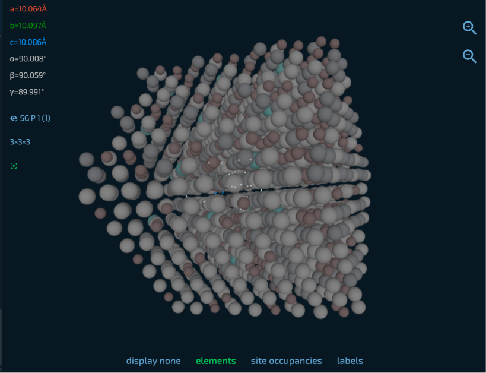

# MetaForge: Machine Learning-Accelerated High Entropy Alloy Discovery

[](https://opensource.org/licenses/MIT)
[](https://www.python.org/downloads/)

## Overview

**MetaForge** is a computational materials science pipeline designed to discover optimal High Entropy Alloys (HEAs) for aerospace, corrosion-resistance, lightweight structural, and high-temperature applications. It combines materials data from the Materials Project with physics-informed machine learning, genetic algorithms for inverse design, and graph neural network structural relaxation.



---

## Core Features

- **Combinatorial Engine:** Generates candidate alloy compositions and filters them using established physical metallurgy rules (e.g., lattice strain limits δ < 6.6% and specific VEC phase thresholds).
- **Property Prediction:** Utilizes Random Forest regression models trained on 132 Matminer Magpie descriptors to predict bulk density and shear strength directly from elemental compositions.
- **Inverse Design:** A custom genetic algorithm evolves alloy compositions over multiple generations to maximize specific strength (strength-to-weight ratio).
- **Structure Relaxation:** Optimizes 54-atom Special Quasirandom Structure (SQS) supercell blueprints using the CHGNet graph neural network interatomic potential.
- **Web Interface:** A lightweight Flask and React interface with a clean, dark-themed UI for real-time model inference.

---

## Model Performance & Discovered Candidates

The pipeline currently supports four distinct HEA categories. The empirical validation metrics for the Random Forest models and the top candidates identified by the genetic algorithm are detailed below:

### 1. Refractory Alloys (BCC)
- **Density Model:** RMSE 0.046 g/cm³ | R² 0.998
- **Strength Model:** RMSE 0.740 GPa | R² 0.995
- **Top Candidate:** `W:9.4% - Mo:70.2% - Ta:1.6% - Nb:7.6% - V:11.3%`
- **Specific Strength:** 11.35 GPa/(g/cm³)

### 2. Corrosion-Resistant Alloys (FCC)
- **Density Model:** RMSE 0.013 g/cm³ | R² 0.993
- **Strength Model:** RMSE 0.153 GPa | R² 0.999
- **Top Candidate:** `Co:5.3% - Cr:40.1% - Fe:41.3% - Ni:1.8% - Cu:11.6%`
- **Specific Strength:** 11.40 GPa/(g/cm³)

### 3. Lightweight Alloys
- **Density Model:** RMSE 0.023 g/cm³ | R² 0.998
- **Strength Model:** RMSE 0.161 GPa | R² 0.998
- **Top Candidate:** `Al:36.4% - Mg:12.7% - Li:16.2% - Ti:33.4% - Zn:1.2%`
- **Specific Strength:** 9.84 GPa/(g/cm³)

### 4. Aerospace Alloys
- **Density Model:** RMSE 0.043 g/cm³ | R² 0.982
- **Strength Model:** RMSE 0.216 GPa | R² 0.982
- **Top Candidate:** `Al:29.9% - Ti:35.1% - Sc:31.1% - Zr:0.7% - V:3.2%`
- **Specific Strength:** 9.35 GPa/(g/cm³)

---

## Architecture & Data Flow

1. **Data Harvesting:** Atomic radii, density, and VEC data are queried from the Materials Project API.
2. **Feature Engineering:** Compositions are filtered by phase rules and featurized into 132 Magpie descriptors.
3. **Training:** Scikit-learn Random Forests map descriptors to density and strength.
4. **Optimization:** Genetic Algorithm maximizes specific strength.
5. **Blueprint Generation:** 54-atom BCC/FCC supercells are outputted as `.cif` files for CHGNet relaxation.

---

## Project Structure

```text
├── HEA.ipynb            # Interactive Jupyter notebook for the discovery pipeline
├── run_master.py        # Master Python script running the full end-to-end engine
├── MetaForge-Web/       # Frontend UI and Flask backend for serving models
├── render.yaml          # Blueprint for direct deployment on Render
└── *.cif                # Generated and relaxed 54-atom 3D SQS blueprints
```

---

## Tech Stack

- **Core Engineering:** Python 3.13+, Pymatgen, Matminer
- **Machine Learning:** Scikit-learn, CHGNet, NumPy, Pandas, Joblib
- **Web Application:** Flask, React, Vanilla CSS

---

## Quickstart

### 1. Environment Setup

```bash
git clone https://github.com/SA-FIND/High-Entropy-Alloy-Discovery.git
cd High-Entropy-Alloy-Discovery

# Create and activate virtual environment (Windows PowerShell)
python -m venv .venv
.\.venv\Scripts\Activate.ps1

# Install dependencies
pip install pymatgen mp-api python-dotenv numpy pandas scikit-learn matplotlib matminer chgnet flask flask-cors joblib
```

### 2. Configure API Keys

Create a `.env` file in the root directory and add your Materials Project API key. This is only required for automated data harvesting in the master script.

```bash
MY_API_KEY=your_materials_project_api_key_here
```

### 3. Execution

You can run the full machine learning pipeline sequentially by executing the master script:

```bash
python run_master.py
```
*Alternatively, you can open and run `HEA.ipynb` for an interactive, cell-by-cell walkthrough of the data harvesting, filtering, and model training process.*

### 4. Local Web Server

To launch the local web server and interact with the trained models:

```bash
cd MetaForge-Web
..\----\Scripts\python.exe app.py
```

---

## Deployment

This repository includes a `render.yaml` Blueprint for direct deployment on Render. The static frontend communicates with a Gunicorn-wrapped Flask backend to serve the machine learning models.

---

## License & Attribution

This project is open-source under the **MIT License**.

**Key Dependencies:**
- Materials Project *(Jain et al., APL Materials, 2013)*
- Matminer *(Ward et al., Comput. Mater. Sci., 2018)*
- CHGNet *(Deng et al., Nature Machine Intelligence, 2023)*
- Pymatgen *(Ong et al., Comput. Mater. Sci., 2013)*
